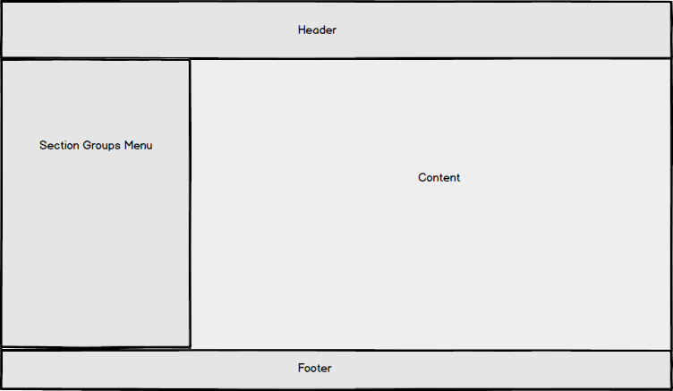
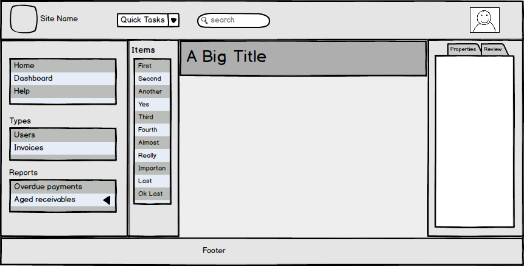

Let's start with a blank screen and, piece by piece, introduce each of 
the top level elements. Remember, Moonlight is concept-first, with a 
particular visualization of that structure into one (or more) layouts.

# Layout Overview

Let's jump right into the visualization of the default layout. This 
overview shows the key elements described in 
[Vocabulary](vocabulary.html):

This shows the first-level children of the <code>layout</code>.

# Initial detail

Well, that's not much to go on. Let's fill in each of those blocks with
some of *Further Vocabulary*:

- Header now has a branding, quick links, search, and user.

- Section groups menu how has 3 sections (default with no heading, 
types which is built into the backend, and reports which was added by 
the sitedev). ``Aged Receivables`` is a section containg subsections, 
as shown the expando triangle.

- The content area has a subheader, listbrowser, and a sidepanel (which
uses tabs to switch between different ways to look at the current 
activity or resource.)
 